# LR6
Лабораторная работа №6


### **Цель работы**
Получить практические навыки работы с системой контроля версий Git:  
— работа с локальным и удалённым репозиторием;  
— создание веток, слияние, разрешение конфликтов;  
— ведение истории изменений;  
— откаты коммитов;  
— оформление отчёта в формате Markdown.

---

## **1. Создание удалённого репозитория**
1. Выполнен Fork репозитория:  
   `https://github.com/Kurtyanik/LR6`
2. Добавлен файл через интерфейс GitHub.

**Скриншот:**  
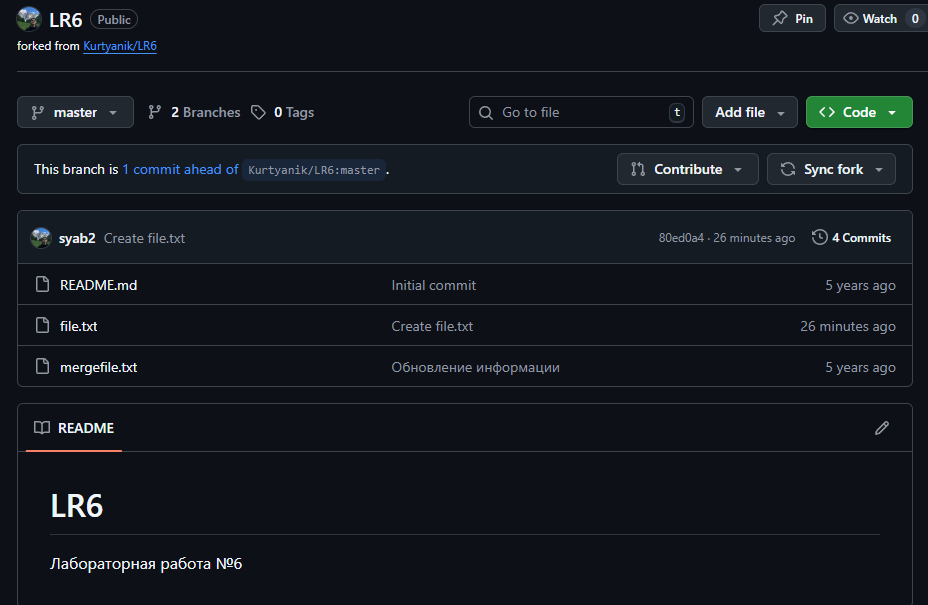

---

## **2. Настройка Git и клонирование репозитория**

### Настройка имени и почты:
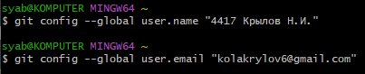

### Клонирование репозитория:
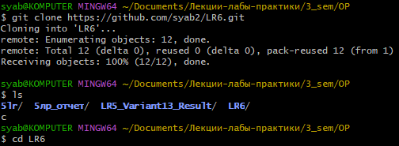

## **3. Добавление файла через GitHub и получение изменений**
Через интерфейс GitHub был добавлен файл.
Локально выполнена команда:
```bash
git pull
```

## **4. Работа с ветками и историей изменений**

### Получение истории операций:
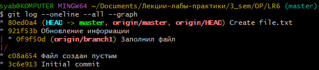

### Просмотр последних изменений:
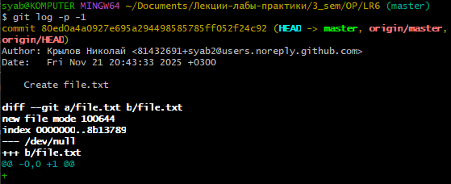

## **5. Слияние веток**

### Попытка слияния веток:
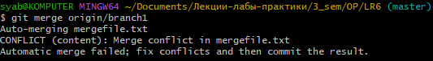

### Разрешение конфликта:
- Решено в текстовом редакторе Nano посредством объединения содержимого обоих файлов.

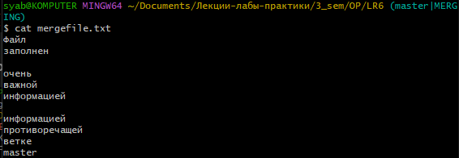
- Коммит результата решения конфликта.

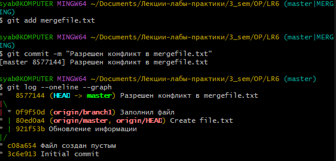
- Проверка слияния веток.

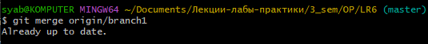

### Удаление побочной ветки:
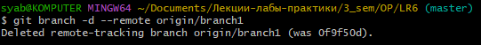

## **6. Два изменения и один откат**
- Осуществлены два изменения при помощи редактора Nano в файле `mergefile.txt`. 
    1. В первом: Добавлена строка "Изменение 1".
    2. Во втором: Добавлена строка "Изменение 2".

    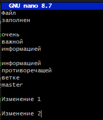

- Откаты коммитов:
    1. Откат второго коммита.

    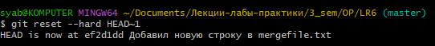

### Полный список команд:

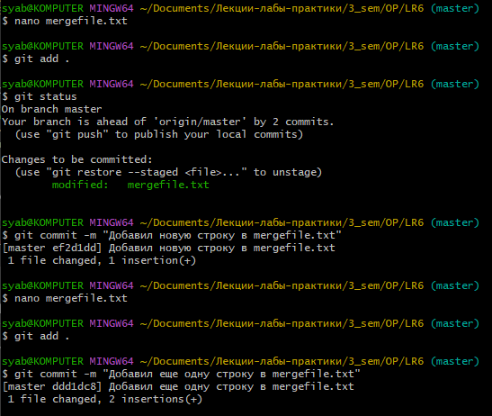

И в конце еще откат изменений.

## **7. Создание ветки для отчёта**

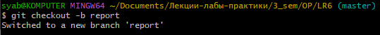

- Вручную создана папка `screens/` для скриншотов.

## **8. Форматированная история операций**

### Получена командой:
```bash
git log --pretty=format:"%h | %ad | %an | %s" --date=short
```

### Результат:
```
06953ed | 2025-11-21 | 4417 Крылов Н.И. | Доделал оставшуюся часть работы
176d52c | 2025-11-21 | 4417 Крылов Н.И. | Сделал первые 4 пункта отчета
ef2d1dd | 2025-11-21 | 4417 Крылов Н.И. | Добавил новую строку в mergefile.txt
8577144 | 2025-11-21 | 4417 Крылов Н.И. | Разрешен конфликт в mergefile.txt
80ed0a4 | 2025-11-21 | Крылов Николай | Create file.txt
921f53b | 2020-11-21 | Kurtyanik | Обновление информации
0f9f50d | 2020-11-21 | Kurtyanik | Заполнил файл
c08a654 | 2020-11-21 | Kurtyanik | Файл создан пустым
3c6e913 | 2020-11-21 | Kurtyanik | Initial commit
```

## **9. Финальная фиксация и отправка в удалённый репозиторий**
```bash
git add .
git commit -m "Финальная версия отчёта"
git push -u origin report
```

## **Итог**
В ходе выполнения лабораторной работы были изучены и применены основные возможности Git: работа с репозиторием, ветками, слиянием, разрешением конфликтов, созданием историй и откатов. Отчёт оформлен в формате Markdown, снабжён логами команд и скриншотами.